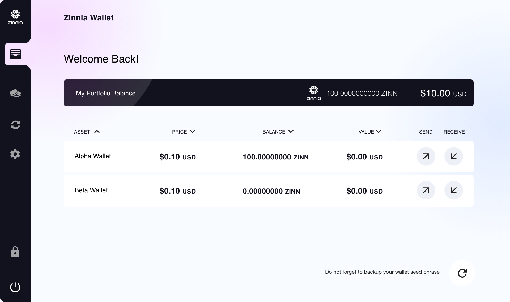

# Основной кошелёк

**Кошелек Zinnia Core (ZCW) содержит весь блокчейн и позволяет пользователям получать, хранить и отправлять цифровые деньги вместе с программой, на нем или с ним.**

## Кошелек Zinnia (ZCW)

Это приложение с открытым исходным кодом, которое представляет собой полноценный узел блокчейн-сети, для запуска кошелька вам нужно будет загрузить и синхронизировать полный блокчейн zinnia с вашим компьютером.

Если вы хотите поддержать сообщество, помочь построить основу сети или интересуетесь техническими аспектами самой сети, мы рекомендуем загрузить этот кошелек.

## Преимущества

**Безопасность**&#x20;

ZCW дает вам полный контроль над вашим Zinn и единоличную ответственность за резервное копирование и защиту вашего кошелька, что означает, что никто не может заморозить или потерять ваши средства. ZCW также позволяет вам использовать Tor в качестве прокси-сервера, чтобы хакеры или интернет-провайдеры не могли связать ваши транзакции с вашим IP-адресом.

**Утверждение**&#x20;

Как полноценная нода, ZCW проверяет и ретранслирует транзакции в сети Zinnia, что означает, что вам не нужно доверять третьей стороне для проверки платежей.

**Прозрачность**&#x20;

ZCW имеет открытый исходный код и построен детерминированно, поэтому любой, у кого есть необходимые навыки, может провести аудит кода, чтобы обеспечить подотчетность, прозрачность и доверие.

**Конфиденциальность**&#x20;

ZCW предотвращает слежку за вашим балансом и платежами путем смены адресов, не раскрывая информацию пользователям сети при отправке или получении платежа.

**Контроль**&#x20;

ZCW позволяет вам быстро подтверждать транзакции без уплаты ненужных комиссий, оценивая условия сети и предоставляя текущие оценки комиссий.
